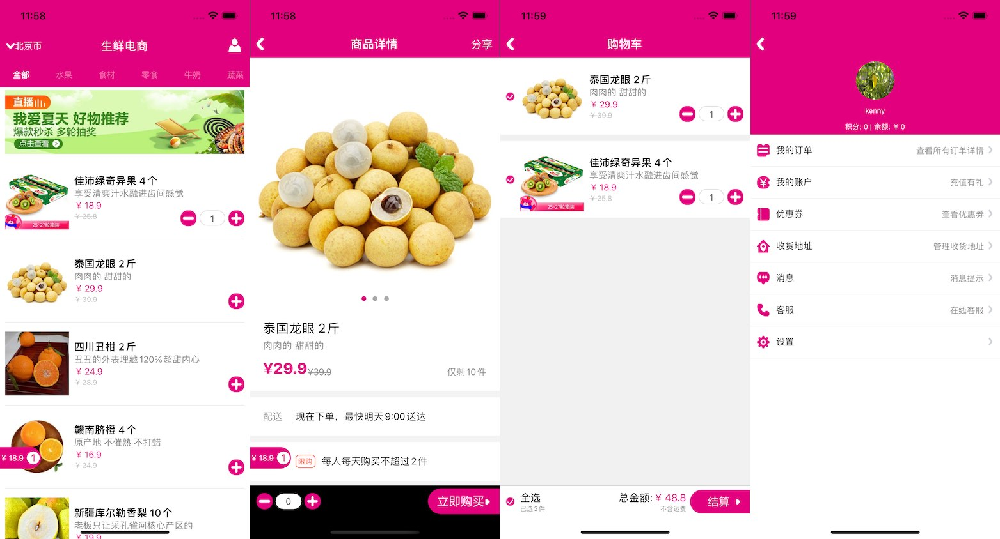

# 生鲜电商项目源码解析

> 此项目为生鲜电商类应用，主要功能包括商品列表、商品详情展示、购物车、登录注册、个人中心等。
> 
> 项目源码在 https://github.com/apicloudcom/avm-simple 仓库下”多端案例-生鲜电商“目录下。
> 
> 如果觉得对您有帮助，希望给个 star 鼓励一下。

项目中前端采用 [avm 多端开发技术](https://docs.apicloud.com/apicloud3?uzchannel=30)进行开发，要点包括 scroll-view 滚动视图、下拉刷新、输入处理、swiper 轮播图、网络请求封装等。使用 APICloud 多端技术进行开发，实现一套代码多端运行，支持编译成 Android & iOS App 以及微信小程序。

项目后端则是使用的 [APICloud 数据云 3.0](https://docs.apicloud.com/Cloud-API/sentosa?uzchannel=30) 自定义云函数来构建的。



### 使用步骤

1. 使用 [APICloud Studio 3](https://www.apicloud.com/studio3?uzchannel=30) 作为开发工具。
2. 下载本项目源码。
3. 在开发工具中新建项目，并将本源码导入新建的项目中，注意更新 config.xml 中的 appid 为你项目的 appid。
4. 使用 AppLoader 进行真机同步调试预览。
5. 或者提交项目源码，并为当前项目云编译自定义 Loader 进行真机同步调试预览。
6. [云编译](https://www.apicloud.com/appoverview?uzchannel=30) 生成 Android & iOS App 以及微信小程序源码包。

如果之前未接触过 APICloud 开发，建议先了解一个简单项目的初始化、预览、调试和打包等操作，请参考 [APICloud 多端开发快速上手教程](https://github.com/apicloudcom/hello-app/blob/main/README.md)。

## 网络请求接口封装

在 script/kn.js 中，封装了统一的网络请求接口 ajax 方法，对整个项目的请求进行统一管理，包括处理传入参数、拼装完整请求 url、设置请求头等，最后调用 api.ajax 方法发起请求，在请求的回调方法里面还对 cookie 是否过期做了全局判断，过期后会清除本地用户登录信息，并提示重新登录。

```js
// kn.js
u.ajax = function(p, callback) {
   var param = p;
   if (!param.headers) {
       param.headers = {};
   }
   param.headers['x-apicloud-mcm-key'] = 'cZKzX7DabDmYyfez';
   if (param.data && param.data.body) {
       param.headers['Content-Type'] = 'application/json; charset=utf-8';
   }
   if (param.url) {
       var baseUrl = 'https://a8888888888888-pd.apicloud-saas.com/api/';
       param.url = baseUrl + param.url;
   }
   api.ajax(param, function(ret, err) {
       if (callback) callback(ret, err);
       if (ret) {
           var status =  ret.status;
           if (status && status == 4001) {
               var didShowLogoutAlert = api.getGlobalData({
                   key: 'didShowLogoutAlert'
               });
               if (!didShowLogoutAlert) {
                   api.setGlobalData({
                       key: 'didShowLogoutAlert',
                       value: true
                   });

                   u.setUserInfo('');
                   api.alert({
                       msg: '登录已失效，请重新登录'
                   }, function() {
                       api.setGlobalData({
                           key: 'didShowLogoutAlert',
                           value: false
                       });
                       api.closeToWin({
                           name: 'root'
                       });
                   });
               }
           }
       }
   });
}
```

使用示例：

```js
// 在 stml 页面通过 import 引入
import $kn from "../../script/kn.js"

// 调用 ajax 方法
// main.stml，从服务器端更新商品分类列表
fnGetWareTypeList() {
  var that = this;
  $kn.ajax({
      url: 'wareTypes/getWareTypeList',
      cache: true
  }, function(ret, err) {
      if (ret && ret.data) {
          that.data.wareTypeList = ret.data;
          that.updatedWareList();
      } else {
          api.toast({
              msg: '获取商品分类失败',
              duration: 2000,
              location: 'bottom'
          });
      }
  });
}
```

## 自定义导航栏封装（组件的使用）

在 components/navigationBar.stml 页面中，我们封装了一个通用的导航栏组件，其中 safe-area 组件能保证里面的内容始终显示在屏幕安全区域内，例如不被状态栏遮挡。在组件页面中，可以通过 this.props 访问父页面传入的属性。

```stml
<template>
    <safe-area class="nav-container">
        <view class="nav-header">
            <view class="nav-header-button nav-left-button" onclick={this.props.onLeftButton ? this.props.onLeftButton : this.onLeftButton}>
                <image width={this.props.leftButtonWidth ? this.props.leftButtonWidth : 11} src={this.props.leftButtonIcon ? this.props.leftButtonIcon : '../../image/back.png'} mode="widthFix"></image>
                <text class="nav-header-text">{this.props.leftButtonText}</text>
            </view>
            <text class="nav-header-title">{this.props.title}</text>
            <view class="nav-header-button nav-right-button" onclick={this.props.onRightButton}>
                <image width={this.props.rightButtonWidth ? this.props.rightButtonWidth : 0} src={this.props.rightButtonIcon ? this.props.rightButtonIcon : ''} mode="widthFix"></image>
                <text class="nav-header-text">{this.props.rightButtonText}</text>
            </view>
        </view>
    </safe-area>
</template>
```

在其它页面使用该组件时，可以设置导航栏标题，以及左右两边按钮的文字、图片、点击事件等。

```
// 引入 navigationBar 组件
import navigationBar from "../../components/navigationBar.stml"

// 在其它 stml 页面使用
// login.stml
<navigationBar title="会员登录" rightButtonText="注册" onRightButton={this.onRightButton}></navigationBar>
```

## 竖向滚动列表

项目中多处用到了列表展示，比如首页的商品列表、城市选择页面、购物车列表等，项目中的列表都使用 scroll-view 配合 v-for 指令来实现的。

```stml
// cityselector.stml
<scroll-view class="cityselector-section" scroll-y='true'>
  <view v-for="(item, index) in dataList">
      <text class="cityselector-city" data-item={item} onclick={this.fnSelectCity}>{item.name}</text>
  </view>
</scroll-view>
```

如果项目只需要支持 App 端，长列表建议使用 list-view 实现，相比于 scroll-view 一下把所有项全部创建出来，list-view 只会创建出可见区域的那几项，并且基本上整个滚动过程中就只有那几项，滚动过程中会对项进行回收重用，性能相比 scroll-view 有非常大的提升。

## 横向滚动列表

在首页商品分类、商品详情页推荐商品都使用了横向滚动视图，scroll-x 属性为 true 的时候 scroll-view 的滚动方向为横向，同时布局方向也变成了横向，即 flex-direction 变成了 row。

```stml
// index.stml
<scroll-view class="nav" scroll-x show-scrollbar="false">
   <text class={'nav-menu'+(this.data.currentIndex==index?' nav-menu-selected':'')} v-for="(item,index) in wareTypeList" data-index={index} onclick={this.fnSetNavMenuIndex}>{item.name}</text>
</scroll-view>
```

## 首页下拉刷新、滚动到底部加载更多

在首页（pages/main/main.stml），通过 scroll-view 实现了商品列表展示，同时实现了下拉刷新、滚动到底部加载更多功能。

```stml
<scroll-view scroll-y='true' class="warelist" enable-back-to-top refresher-enabled refresher-triggered={this.data.refresherTriggered} onrefresherrefresh={this.onrefresherrefresh} onscrolltolower={this.onscrolltolower}>
   <view class="header">
       <image class="banner" src={this.data.bannerUrl} placeholder="../../image/default_rect.png" thumbnail="false" mode="widthFix">
   </view>
   <view>
       <view class="cell" v-for="(item, index) in dataList">
           <view data-id={item.id} data-wareCount={item.wareCount} class="container" onclick={this.fnOpenDetailWin}>
               <image class="thumbnail" src={item.thumbnail} placeholder="../../image/default_square.png"></image>
               <view class="info">
                   <text class="info-name">{item.name + ' ' + (item.unit||'')}</text>
                   <text class="info-description">{item.description}</text>
                   <text class="info-price">{'￥'+item.price}</text>
                   <text class="info-origin-price">{'￥'+item.originPrice}</text>
               </view>
               <view class="control">
                   <image class={item.wareCount>0?'minus':'none'} data-index={index} src="../../image/minus.png" onclick={this.fnMinus}>
                   <text class={item.wareCount>0?'count':'none'}>{item.wareCount}</text>
                   <image class="add" data-index={index} src="../../image/add.png" onclick={this.fnAdd}>
               </view>
           </view>
       </view>
   </view>
   <view class="footer">
       <text class="loadDesc">{this.data.haveMoreData?'加载中...':'没有啦！'}</text>
   </view>
</scroll-view>
```

下拉刷新使用了 scroll-view 默认的下拉刷新样式，使用 refresher-enabled 字段来开启下拉刷新，为 refresher-triggered 字段绑定了 refresherTriggered 属性来控制下拉刷新状态，需要注意的是，在刷新的事件回调方法里面，我们需要主动设置 refresherTriggered 的值为 true，在数据加载完成后再设置为 false，这样绑定的值有变化，刷新状态才能通知到原生里面。

```js
onrefresherrefresh(){
	this.data.refresherTriggered = true;
	this.fnGetWareList(false);
}
```

滚动到底部监听了 scroll-view 的 scrolltolower 事件，在滚动到底部后自动加载更多数据，加载更多和下拉刷新都是调用 fnGetWareList 方法请求数据，通过 loadMore_ 参数来进行区分，做分页请求处理。

```js
fnGetWareList(loadMore_) {
  // 如果是加载更多，需要实现分页
  var limit = 20;
  if (loadMore_) {
      this.data.skip += limit;
  } else {
      this.data.skip = 0;
  }

  var currentCity = $kn.getCurrentCityInfo();
  var that = this;
  // 根据城市和商品分类获得相应的商品列表
  $kn.ajax({
      url: 'wares/getWareList',
      method: 'post',
      data: {
          body: {
              supportAreaId: currentCity?currentCity.id:'',
              wareTypeId: this.data.wareTypeId,
              skip: this.data.skip,
              limit: limit
          }
      }
  }, function(ret, err) {
      if (ret && ret.data) {
          var cartData = api.getGlobalData({key: 'cartInfo'});
          var data = ret.data;
          that.data.haveMoreData = data.length == limit;
          that.getFixedWareList(data, cartData?cartData.wareList:null);
          if (loadMore_) {
              that.data.dataList = that.data.dataList.concat(data);
          } else {
              that.data.dataList = data;
          }
      } else {
          api.toast({
              msg: '加载数据失败',
              duration: 2000,
              location: 'bottom'
          });
      }
      that.data.refreshState = 'normal';
      that.data.refresherTriggered = false;
  });
}
```

## 商品详情页轮播图

商品详情页路径为 pages/ware/ware.stml，里面轮播图使用 swiper 组件实现，使用 v-for 指令循环 swiper-item，picList 为定义的数组类型的属性。

```html
<swiper class="swiper shrink" style={'height:'+this.data.swiperHeight+'px;'} indicator-dots indicator-active-color="#e3007f" autoplay circular>
	<swiper-item v-for="(_item,index) in picList">
		<image class="img" placeholder="../../image/default_square.png" src={_item} mode="aspectFit" thumbnail="false"></image>
	</swiper-item>
</swiper>
```

轮播图的宽度跟随屏幕宽度变化，高度则通过属性 swiperHeight 来设置，以保持图片宽高显示比例不变。

## 登录、注册页面输入处理

登录、注册页面结构相似，从下面的代码可以看到登录页面由两部分组成，顶部为导航栏，剩下的主体内容外面加了一个 scroll-view，加 scroll-view 的目的，一方面是为了保证在小屏幕手机上面显示不完全时能够滚动查看内容，另一个目的则是为了让输入框获取焦点弹出键盘后，只让 scroll-view 内主体部分往上移动，而导航栏部分保持不动。

```
// login.stml
<view class="main"> 
   <navigationBar title="会员登录" rightButtonText="注册" onRightButton={this.onRightButton}></navigationBar>
   <scroll-view class="scrollView" scroll-y='true'>
       <view class="container">
           <input id="username" class="input" placeholder="用户名"/>
           <input id="password" class="input" type="password" placeholder="密码"/>
           <text class="btn" onclick={this.fnLogin}>登录</text>
           <view class="third-login">
               <text class="third-login-desc">第三方登录</text>
               <view class="icon-container">
                   <image class="icon" data-type="Apple" src="../../image/logo_apple.png" onclick={this.fnThirdLogin}/>
                   <image class="icon" data-type="微信" src="../../image/logo_wx.png" onclick={this.fnThirdLogin}/>
               </view>
           </view>
       </view>
   </scroll-view>
</view>
```

## 个人中心上传头像

在个人中心页面（pages/personalcenter/personalcenter.stml），我们使用了 img 标签来展示用户头像，当用户点击头像后可以修改头像。这里根据用户选择的选择图片方式，我们会先判断是否有对应的权限，如果有权限则调用 api.getPicture 方法选取图片，如果没有权限，则提示用户去设置权限。

```js
fnSetAvatar() {
  var that = this;
  api.actionSheet({
      title: '选择图片',
      cancelTitle: '取消',
      buttons: ['拍照', '相册']
  }, function(ret, err) {
      if (ret) {
          var sourceTypes = ['camera', 'album'];
          if (ret.buttonIndex == (sourceTypes.length + 1)) {
              return;
          }
          var sourceType = sourceTypes[ret.buttonIndex - 1];
          var permission = ret.buttonIndex == 1?'camera':'photos';
          var resultList = api.hasPermission({
              list: [permission]
          });
          if (resultList[0].granted) {
              that.getPicture(sourceType);
          } else {
              api.confirm({
                  msg: '应用需要您的授权才能访问' + (permission=='camera'?'相机':'相册'),
                  buttons: ['取消', '去设置']
              }, function(ret1) {
                  if (ret1.buttonIndex == 2) {
                      api.requestPermission({
                          list: [permission],
                      }, function(ret2) {
                          if (ret2.list[0].granted) {
                              that.getPicture(sourceType);
                          }
                      });
                  }
              });
          }
      }
  });
}
```

选取本地图片成功后调用封装好的 ajax 方法上传选择的图片。

```js
fnUpdateAtavar(avatarUrl_) {
  var that = this;
  $kn.ajax({
      url: 'users/updateAvatar',
      method: 'post',
      data: {
          values: {
              filename: 'icon.jpg'
          },
          files: {
              file: avatarUrl_
          }
      }
  }, function(ret, err) {
      if (ret && ret.data) {
          
      } else {
          api.toast({
              msg:'头像修改失败'
          });
      }
  });
}
```